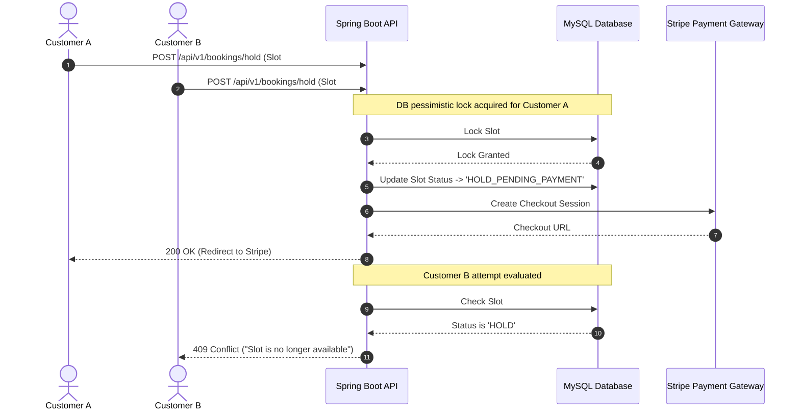

# 💳 MultiVendor: Service Marketplace & Booking Platform

[](https://www.oracle.com/java/)
[](https://spring.io/projects/spring-boot)
[](https://spring.io/projects/spring-security)
[](https://www.mysql.com/)
[](https://stripe.com/)
[](LICENSE)

**MultiVendor** is an enterprise-grade service marketplace and interactive booking platform engineered with **Java 21, Spring Boot 3, Spring Security JWT, MySQL, and Stripe Checkout Sandbox integration**. 

It is designed to solve real-world concurrent reservation challenges by preventing double-booking race conditions through **Database Row-Level Pessimistic Locking (`SELECT FOR UPDATE`)** and background hold expiration cleanup daemons.

---

## 🌟 Key Technical Highlights for Resume & GitHub

* **Database Concurrency Control**: Eliminates double-booking race conditions using JPA `@Lock(LockModeType.PESSIMISTIC_WRITE)` and 10-minute hold reservation windows.
* **Stripe Checkout Sandbox & Webhooks**: Supports Stripe Checkout payment session creation and asynchronous signature-verified Webhook handling (`/api/v1/webhooks/stripe`).
* **Multi-Role RBAC**: Granular security for `CUSTOMER`, `VENDOR`, and `ADMIN` roles powered by stateless JWT Bearer tokens and BCrypt hashing.
* **Dynamic Vendor Scheduling**: Vendor portal with batch slot generation, earnings tracking, and interactive **Chart.js** revenue analytics.
* **OpenAPI 3 / Swagger Documentation**: Interactive API testing available at `/swagger-ui.html`.

---

## 🏗️ System Architecture & Concurrency Lock



---

## 🚀 Separate Portals & Run Commands

You can run the Backend, Customer Portal, and Vendor Portal in separate terminals with dedicated commands:

### 1. Run Backend Server (Terminal 1 - Port 8081)
```bash
npm run backend
# Or: .\start-backend.bat
# Or: cd backend && mvn spring-boot:run
```
* **REST API**: `http://localhost:8081/api/v1`
* **Swagger API Docs**: `http://localhost:8081/swagger-ui.html`
* **Persistent DB Console**: `http://localhost:8081/h2-console` (JDBC URL: `jdbc:h2:file:./data/multivendordb`)

### 2. Run Customer & Public Portal (Terminal 2 - Port 5500)
```bash
npm run customer
# Or: .\start-customer-portal.bat
# Or: cd frontend && npx serve -l 5500
```
* **Customer Services Marketplace**: `http://localhost:5500` (or `http://localhost:5500/user.html`)
* *Audience: General Public & Customers only (No vendor management visible)*

### 3. Run Dedicated Vendor Command Portal (Terminal 3 - Port 5501)
```bash
npm run vendor
# Or: .\start-vendor-portal.bat
# Or: cd frontend && npx serve -l 5501
```
* **Vendor Command Center**: `http://localhost:5501/vendor.html`
* *Audience: Service Providers & Vendors only (Role-protected management, revenue analytics, batch generator)*

---

## 💾 Permanent Database Architecture & Cloud Servers

* **Permanent Disk Database**: By default, data is stored permanently on disk in `./data/multivendordb.mv.db`. No local MySQL installation is needed!
* **Cloud Database Support**: Easily connect to any Cloud PostgreSQL or MySQL server (Neon, Supabase, Railway, Aiven, AWS RDS) by providing standard environment variables:
  ```powershell
  $env:DB_URL="jdbc:postgresql://<your-cloud-db-host>/multivendordb?sslmode=require"
  $env:DB_USERNAME="<db-user>"
  $env:DB_PASSWORD="<db-password>"
  ```
* **Non-Destructive Initialization**: Demo accounts and services are only initialized if the database is brand new. All user registrations, bookings, and slots persist permanently across server restarts.

---

## 🔑 Demo Login Credentials (1-Click Autofill in UI)

| Role | Email | Password | Dedicated Portal & Features |
|---|---|---|---|
| **Customer** | `customer.john@gmail.com` | `password123` | **`user.html`**: Category filters, live search, 3D card payment, "My Appointments", invoice receipts |
| **Vendor** | `vendor.alex@multivendor.com` | `password123` | **`vendor.html`**: Glowing Chart.js analytics, service CRUD, batch slot generator, customer order feed |
| **Admin** | `admin@multivendor.com` | `password123` | System metrics, vendor approval, user management |

---

## 🧪 Testing

Run backend unit tests and multi-threaded concurrency lock tests:

```bash
cd backend
mvn test
```

* `BookingServiceTest.java`: Unit tests with Mockito.
* `BookingConcurrencyTest.java`: Multi-threaded test launching 10 parallel threads attempting to reserve the exact same slot to verify exactly 1 succeeds and 9 fail with `409 Conflict`.

---

## 📑 Project Structure

```text
MultiVendor/
├── backend/                  # Java 21 Spring Boot 3 Fullstack API & Server
│   ├── src/main/java/com/multivendor/
│   │   ├── config/           # Security, DataInitializer, CORS, Stripe, Swagger
│   │   ├── controller/       # Auth, Services, Vendors, Bookings, Users, Admin
│   │   ├── dto/              # Request/Response DTOs
│   │   ├── model/            # JPA Entities (User, Vendor, Service, Slot, Booking)
│   │   ├── repository/       # JPA Repositories with Pessimistic Locking
│   │   └── service/          # Core Business Logic, Cleanup & Notification
│   ├── src/main/resources/
│   │   ├── application.yml   # Persistent Disk & Cloud DB Configuration
│   │   └── static/           # Spring Boot Served Futuristic Fullstack UI
│   └── src/test/             # JUnit 5 & Concurrency Tests
├── frontend/                 # Futuristic Cyber-Glassmorphism UI
│   ├── index.html            # Customer Marketplace Portal
│   ├── user.html             # Dedicated Customer / User Portal
│   ├── vendor.html           # Dedicated Vendor Command Center
│   ├── vendor-dashboard.html # Vendor Hub & Chart.js Analytics
│   ├── css/styles.css        # Cyberpunk & Deep Space Glassmorphism Design System
│   └── js/                   # API, Auth, Calendar, Vendor, Profile JS modules
├── credentials.txt           # Credentials & Run Instructions
└── docker-compose.yml
```

---

## 💼 Resume Bullet Point Template

> **Full Stack Engineer | MultiVendor Enterprise Platform**
> * *Built a high-concurrency service booking marketplace using **Java 21, Spring Boot 3, Spring Data JPA, and Persistent Database Storage** supporting real-time availability calendars and Stripe Sandbox payments.*
> * *Designed database row-level **pessimistic write locks (`SELECT FOR UPDATE`)** and background `@Scheduled` cleanup daemons to eliminate double-booking race conditions under high parallel traffic.*
> * *Engineered dedicated **Customer and Vendor Portals** with an ultra-futuristic **Cyber-Glassmorphism UI**, real-time **Chart.js** revenue analytics, and batch availability schedule generation.*
