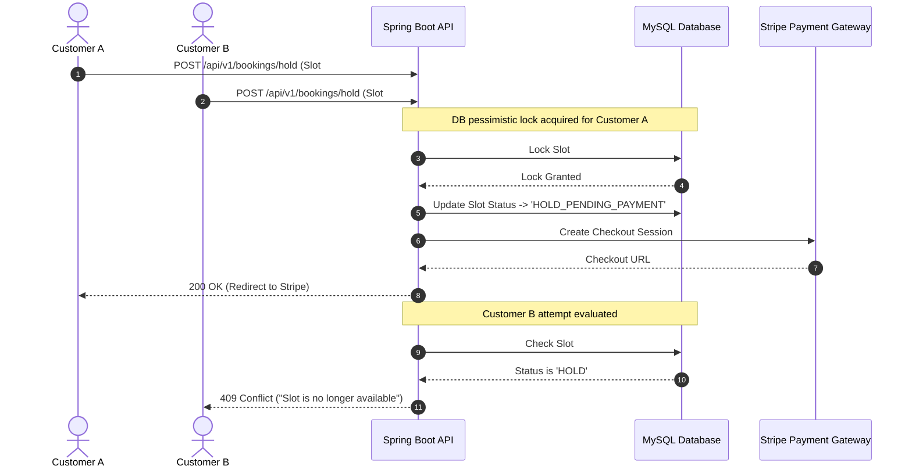

# 💳 MultiVendor: Service Marketplace & Booking Platform

[](https://www.oracle.com/java/)
[](https://spring.io/projects/spring-boot)
[](https://spring.io/projects/spring-security)
[](https://www.mysql.com/)
[](https://stripe.com/)
[](LICENSE)

**MultiVendor** is an enterprise-grade service marketplace and interactive booking platform engineered with **Java 21, Spring Boot 3, Spring Security JWT, MySQL, and Stripe Checkout Sandbox integration**. 

It is designed to solve real-world concurrent reservation challenges by preventing double-booking race conditions through **Database Row-Level Pessimistic Locking (`SELECT FOR UPDATE`)** and background hold expiration cleanup daemons.

---

## 🌟 Key Technical Highlights for Resume & GitHub

* **Database Concurrency Control**: Eliminates double-booking race conditions using JPA `@Lock(LockModeType.PESSIMISTIC_WRITE)` and 10-minute hold reservation windows.
* **Stripe Checkout Sandbox & Webhooks**: Supports Stripe Checkout payment session creation and asynchronous signature-verified Webhook handling (`/api/v1/webhooks/stripe`).
* **Multi-Role RBAC**: Granular security for `CUSTOMER`, `VENDOR`, and `ADMIN` roles powered by stateless JWT Bearer tokens and BCrypt hashing.
* **Dynamic Vendor Scheduling**: Vendor portal with batch slot generation, earnings tracking, and interactive **Chart.js** revenue analytics.
* **OpenAPI 3 / Swagger Documentation**: Interactive API testing available at `/swagger-ui.html`.

---

## 🏗️ System Architecture & Concurrency Lock



---

## 🚀 Quick Start Guide

### Option 1: Run with Docker Compose (Recommended)

```bash
docker compose up --build
```
* **Frontend Marketplace**: Open `http://localhost:5500` or serve `frontend/index.html` with Live Server.
* **Backend REST API**: `http://localhost:8081`
* **Swagger API Docs**: `http://localhost:8081/swagger-ui.html`

### Option 2: Run Spring Boot Locally (In-Memory H2 / MySQL)

```bash
cd backend
mvn spring-boot:run
```

Access H2 Database Console at `http://localhost:8081/h2-console` (JDBC URL: `jdbc:h2:mem:multivendordb`).

---

## 🔑 Demo Login Credentials

| Role | Email | Password | Features |
|---|---|---|---|
| **Customer** | `customer.john@gmail.com` | `password123` | Browse catalog, select availability slots, trigger Stripe payment hold |
| **Vendor** | `vendor.alex@multivendor.com` | `password123` | Create services, batch generate slots, view Chart.js revenue stats |
| **Admin** | `admin@multivendor.com` | `password123` | System metrics, vendor approval, user management |

---

## 🧪 Testing

Run backend unit tests and multi-threaded concurrency lock tests:

```bash
cd backend
mvn test
```

* `BookingServiceTest.java`: Unit tests with Mockito.
* `BookingConcurrencyTest.java`: Multi-threaded test launching 10 parallel threads attempting to reserve the exact same slot to verify exactly 1 succeeds and 9 fail with `409 Conflict`.

---

## 📑 Project Structure

```text
MultiVendor/
├── backend/                  # Java 21 Spring Boot 3 API
│   ├── src/main/java/com/multivendor/
│   │   ├── config/           # Security, CORS, Stripe, Swagger Config
│   │   ├── controller/       # Auth, Services, Vendors, Bookings, Webhooks
│   │   ├── dto/              # Request/Response DTOs
│   │   ├── model/            # JPA Entities (User, Vendor, Service, Slot, Booking)
│   │   ├── repository/       # JPA Repositories with Pessimistic Locking
│   │   └── service/          # Core Business Logic & Scheduled Cleanup
│   └── src/test/             # JUnit 5 & Concurrency Tests
├── frontend/                 # Glassmorphism UI
│   ├── index.html            # Marketplace Catalog UI
│   ├── vendor-dashboard.html # Vendor Hub & Chart.js Analytics
│   ├── css/styles.css        # Design system & dark theme tokens
│   └── js/                   # API, Auth, Calendar, Vendor JS modules
├── database/schema.sql       # MySQL DDL & Seed Data
├── docs/                     # ERD & Concurrency Locking Guides
└── docker-compose.yml
```

---

## 💼 Resume Bullet Point Template

> **Full Stack Engineer | MultiVendor Booking Platform**
> * *Built a high-concurrency service booking marketplace using **Java 21, Spring Boot 3, Spring Data JPA, and MySQL** supporting real-time availability calendars and Stripe Sandbox payments.*
> * *Designed database row-level **pessimistic write locks (`SELECT FOR UPDATE`)** and background `@Scheduled` cleanup daemons to eliminate double-booking race conditions under high parallel traffic.*
> * *Developed stateless **JWT authentication & Role-Based Access Control (RBAC)** across Customer, Vendor, and Admin portals; containerized backend services using **Docker Compose**.*
