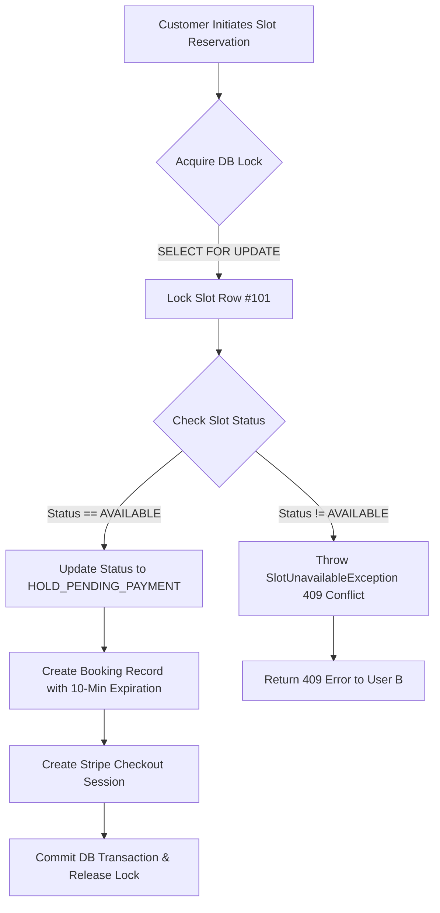

# Concurrency Control & Double-Booking Prevention Strategy

## Problem Overview

In a high-traffic service booking marketplace, multiple customers may concurrently attempt to reserve the exact same availability slot (e.g., Friday 2:00 PM - 3:00 PM for Tutor A). 

Without robust concurrency mechanisms, race conditions occur:
1. User A reads Slot #101 (`status = 'AVAILABLE'`).
2. User B simultaneously reads Slot #101 (`status = 'AVAILABLE'`).
3. Both User A and User B proceed to checkout.
4. Both payments succeed, resulting in a **double-booking bug**, vendor schedule collision, and customer dissatisfaction.

---

## Technical Solution: Database Pessimistic Locking & Temporary Holds

The platform resolves race conditions through a **two-phase reservation workflow**:



### 1. Spring Data JPA `@Lock(LockModeType.PESSIMISTIC_WRITE)`

When a booking hold is requested, the repository executes a `SELECT ... FOR UPDATE` SQL query:

```java
@Lock(LockModeType.PESSIMISTIC_WRITE)
@Query("SELECT s FROM AvailabilitySlot s WHERE s.id = :slotId")
Optional<AvailabilitySlot> findByIdWithPessimisticLock(@Param("slotId") Long slotId);
```

* **Behavior**: The database engine places an exclusive row-level lock on the target `availability_slots` record.
* **Isolation**: Any concurrent transaction trying to read or modify the same slot is blocked until the active lock owner commits or rolls back.

### 2. Time-Bound Booking Holds (`HOLD_PENDING_PAYMENT`)

To prevent users from locking slots indefinitely without paying:
* The system sets a **10-minute expiration countdown** (`hold_expires_at = NOW() + 10 mins`).
* A background scheduled task (`@Scheduled`) automatically sweeps and releases expired hold slots back to `AVAILABLE` status.

```java
@Scheduled(fixedDelay = 60000) // Runs every 60 seconds
@Transactional
public void releaseExpiredHolds() {
    List<Booking> expiredBookings = bookingRepository.findExpiredHolds(LocalDateTime.now());
    for (Booking booking : expiredBookings) {
        booking.setStatus(BookingStatus.CANCELLED);
        booking.getSlot().setStatus(SlotStatus.AVAILABLE);
    }
}
```

### 3. Stripe Webhook Synchronization

Upon successful Stripe Checkout payment, Stripe sends a signature-verified `payment_intent.succeeded` webhook event:
* The backend verifies the event signature using `Webhook.constructEvent(...)`.
* The booking status transitions atomically from `HOLD_PENDING_PAYMENT` to `CONFIRMED`.
* The slot status transitions atomically to `BOOKED`.

---

## Resume Bullet Point Highlight

> *"Implemented database row-level pessimistic locking (`SELECT FOR UPDATE`) and background cleanup daemons in Java Spring Boot to eliminate slot reservation race conditions and double-booking bugs under high concurrent load."*
